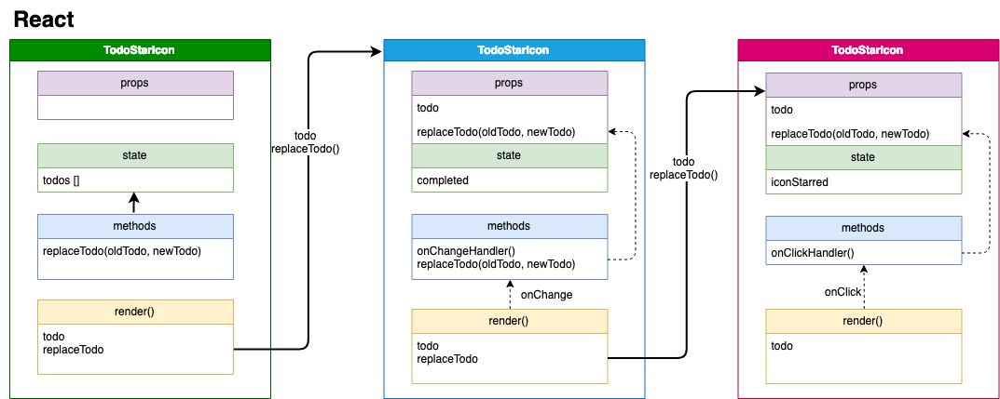

# M.I.T Todo App

[Demo App in react.js](https://mit-todo-react.netlify.com/)

This Todo Demo App implemented with `react.js`.

I have also another implementation in `Vue.js`, which is implemented in the same concept.
[Demo App in Vue.js](https://mit-todo.netlify.com/)

## What is `MITs`
Never feel overwhelmed at work again- the M.I.T. technique. A `Most Important Task (MIT)` is a 
critical task that will create the most significant results. 
Every day, create a list of `two or three M.I.T.s`, and focus on getting them done as soon as 
possible. Keep this list separate from your general to-do list. Read more about [MITs](https://personalmba.com/most-important-tasks/).  

**Example Todos**


**Communication between react components**



## Project setup
```
yarn install
```

### Compiles and hot-reloads for development
```
yarn start
```

### Compiles and minifies for production
```
yarn build
```

## License
[MIT](http://opensource.org/licenses/MIT)


Copyright(c) 2019-present, Xun Zhou
